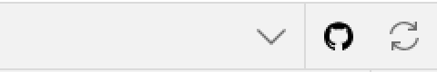
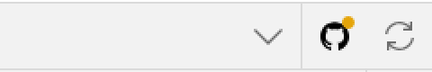
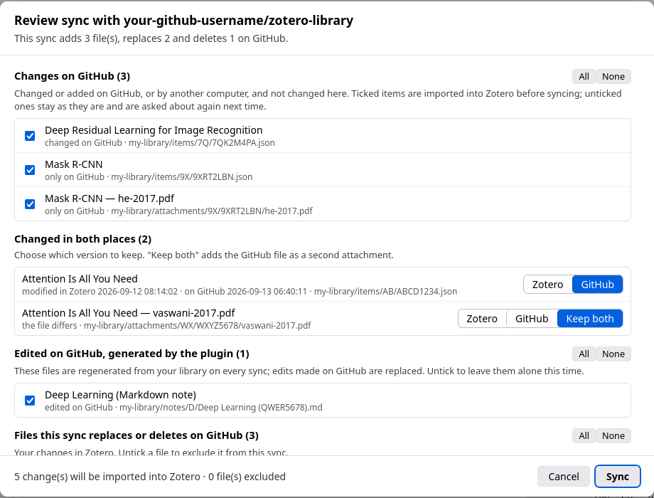

# Zotero GitHub Sync

Back up your whole Zotero library — metadata, notes, annotations, and the PDFs, books and
other files themselves — to a GitHub repository, public or private. Every item becomes a
JSON file and a readable Markdown note, large files go through Git LFS, and every sync is an
ordinary Git commit you can browse, clone or roll back.


Works with Zotero 7 through 10.

**[Download the latest release](https://github.com/situkangsayur/zotero-github-plugin/releases/latest)** ·
**[Step-by-step tutorial](docs/TUTORIAL.md)** ·
**[Tutorial (Bahasa Indonesia)](docs/TUTORIAL.id.md)**

> **Status:** tested on Zotero 10 (Linux) with a 1,740-item library and about 700 MB of
> PDFs — a first sync, a full *Import from GitHub* into an empty profile that restored every
> item, annotation and file byte for byte, and a scripted two-computer run covering edits,
> deletions and conflicts on both sides. Other Zotero versions and group libraries are less
> tested. See [CHANGELOG.md](CHANGELOG.md).

---

## What it does

- **Backs up the whole library.** Items, notes, PDF annotations, tags, collections, saved
  searches, tag colors, and every attachment file: stored PDFs and books, web snapshots,
  images in notes, and linked files.
- **Handles large files.** Files over 50 MB (configurable) go to Git LFS, since GitHub
  refuses anything over 100 MB in Git.
- **Only uploads what changed.** Files are hashed with Git's own blob hash and the hashes
  are cached, so an unchanged library makes no commit and reads no PDFs.
- **Survives big first syncs.** Metadata and notes go up in a handful of requests; files are
  committed in checkpoints and paced under GitHub's rate limits. A cancelled or failed sync
  keeps what it already committed and the next one carries on.
- **Shows what it's doing.** A toolbar button next to Zotero's own sync button spins while
  syncing, shows the percentage, and turns red when something fails. Right-click to cancel.
- **Never overwrites what it can't account for.** It remembers what this computer last
  synced, so it can tell your changes from changes made on GitHub or by another computer.
  Anything that needs a decision opens a review: import changes from GitHub, pick a side
  when both changed, and exclude files you don't want replaced. Background syncs upload only
  what is safe and flag the rest.
- **Syncs when you want.** Button, Tools menu, right-click on items or collections, on a
  timer, after edits, at startup, or right after Zotero's own sync.
- **Readable output.** Markdown notes carry YAML front matter, so the repository doubles as
  an Obsidian vault.
- **Restores.** *Import from GitHub* rebuilds items, collections, annotations and files on
  another computer, with the same item keys.

| Idle | Syncing | Needs review | Failed |
| --- | --- | --- | --- |
|  |  |  |  |

## What it is not

It is not a replacement for Zotero's own data sync. Zotero stays the authoritative copy and
the repository is a versioned, readable mirror: changes found on GitHub are imported only
when you accept them in the review, and nothing is ever deleted from your library.

## Documentation

- **[docs/TUTORIAL.md](docs/TUTORIAL.md)** ([Bahasa Indonesia](docs/TUTORIAL.id.md)) —
  installing, creating a token, configuring, the first sync, troubleshooting, restoring.
- **[docs/DATA-FORMAT.md](docs/DATA-FORMAT.md)** — exactly what lands in the repository:
  directory layout, the item JSON schema, front-matter fields, naming rules, and what to
  build on if you want to read the data from another tool.
- **[docs/ARCHITECTURE.md](docs/ARCHITECTURE.md)** — how the sync pipeline works: batching,
  checkpoints, rate limiting, the hash cache, Git LFS, and how pruning avoids touching files
  it did not write.
- **[docs/DEVELOPMENT.md](docs/DEVELOPMENT.md)** — building, running from source,
  debugging, testing, taking the tutorial screenshots, and releasing.
- **[CHANGELOG.md](CHANGELOG.md)** — what changed, and what is known not to work yet.

---

## Install

1. Download `zotero-github-sync-<version>.xpi` from the
   [Releases](https://github.com/situkangsayur/zotero-github-plugin/releases/latest) page.
   (In Firefox, right-click the link and choose *Save Link As…* so the browser doesn't
   try to install it itself.)
2. In Zotero: **Tools → Plugins → gear icon → Install Plugin From File…**
3. Pick the `.xpi`.

Or build it yourself — see [Development](#development).

## Set up

The [tutorial](docs/TUTORIAL.md) walks through this with screenshots. In short:

### 1. Create a GitHub token

**Fine-grained token** (recommended) — <https://github.com/settings/personal-access-tokens/new>

- *Repository access*: only the repository you'll sync to.
- *Permissions → Repository permissions → Contents*: **Read and write**. This also covers
  Git LFS. *Metadata: Read-only* is added automatically.
- *Administration*: **Read and write** — only if you want the plugin to create the
  repository for you. Not needed if you create it yourself first.

**Classic token** — <https://github.com/settings/tokens>: tick the **repo** scope.

The token is stored in Zotero's password manager (the same place Zotero keeps its own
API key), not in the preferences file.

### 2. Configure the plugin

**Edit → Settings → GitHub Sync** (macOS: **Zotero → Settings**)

| Setting | What it does |
| --- | --- |
| Personal access token | Paste, then **Save token**, then **Test connection** |
| Owner | Your GitHub username or an organization |
| Repository | e.g. `my-zotero-library` |
| Branch | `main` by default; created from the default branch if missing |
| Folder inside the repository | e.g. `zotero`. Leave empty to use the repository root |
| Create the repository if it does not exist | Creates it on the first sync |
| Create it as a private repository | Applies only when the plugin creates it |

**Test connection** tells you who the token authenticates as, whether it can see the
repository, and whether it can write to it — check it before your first sync.

What gets synced is under the same pane. By default that is everything: attachment files,
linked files, and group libraries, with files over 50 MB sent to Git LFS.

### 3. Choose when to sync

| Trigger | Where |
| --- | --- |
| Manual | The GitHub button in the toolbar, **Tools → GitHub Sync → Sync Library Now**, or **Sync now** in settings |
| With a review | **Tools → GitHub Sync → Review Changes and Sync…**, or click the button when it shows an orange dot |
| Selected items | Right-click items → *Sync Selected Items to GitHub* |
| A collection | Right-click a collection → *Sync This Collection to GitHub* (includes subcollections) |
| Every N minutes | *Sync every … minutes* |
| After edits | *Sync after the library changes*, waiting N minutes for edits to settle |
| At startup | *Sync shortly after Zotero starts* (runs one minute after launch) |
| After Zotero's sync | *Sync to GitHub after Zotero's own sync finishes* |

Background syncs never open a window; the toolbar button shows their progress and turns red
if one fails. Nothing the plugin shows is a modal dialog.

---

## Repository layout

```
<base path>/
├── README.md                                  overview, regenerated each sync
├── .zotero-sync/
│   ├── manifest.json                          schema and plugin version
│   └── files.json                             every path this plugin manages
└── my-library/
    ├── library.json                           library metadata
    ├── collections.json                       every collection with its full path
    ├── searches.json                          saved searches
    ├── settings.json                          tag colors
    ├── index.md                               table of contents by collection
    ├── library.bib                            optional BibTeX export
    ├── items/AB/ABCD1234.json                 the item, its notes, attachments and annotations
    ├── notes/A/Attention Is All You Need (ABCD1234).md
    ├── attachments/WX/WXYZ5678/paper.pdf      files up to 50 MB
    └── attachments-lfs/BI/BIGF0001/book.pdf   larger files, via Git LFS
```

Group libraries land in `group-<groupID>-<name>/` with the same structure. Directories are
split by the first characters of the Zotero key (or the note title's first letter), because
GitHub recommends no more than 3,000 entries in one directory. The full spec — field by
field, including what is safe to depend on — is in [docs/DATA-FORMAT.md](docs/DATA-FORMAT.md).

Each `items/<KE>/<KEY>.json` holds `zotero` (the Zotero API JSON of the top-level item),
`children` (its notes, attachments, annotations and note images, in the same format — this
is what *Import from GitHub* reads back) and `meta` (derived fields: collection paths,
author strings, where each attachment's files are).

Markdown notes look like this:

```markdown
---
title: "Attention Is All You Need"
item-type: "conferencePaper"
authors:
  - "Vaswani, Ashish"
date: "2017"
doi: "10.48550/arXiv.1706.03762"
tags:
  - "transformers"
collections:
  - "Papers/NLP"
zotero-key: "ABCD1234"
zotero-uri: "zotero://select/library/items/ABCD1234"
---

# Attention Is All You Need
...
## Annotations

- **p. 1, highlight** “Attention is all you need”
```

### Syncing from more than one computer

Each computer remembers, per repository, what it last synced. On every sync the plugin
compares three versions of each file — what Zotero exports now, what GitHub holds, and that
last-synced version — and sorts the differences:

| What happened | What a sync does |
| --- | --- |
| Changed in Zotero only | Uploads it |
| Deleted in Zotero since the last sync | Deletes it on GitHub |
| Changed or added on GitHub only | Asks whether to import it |
| Changed in both places | Asks which version to keep (or keep both, for files) |
| Deleted on GitHub, still in Zotero | Asks whether to upload it again |



A manual sync shows the review whenever something needs a decision; **Tools → GitHub Sync →
Review Changes and Sync…** shows it every time, including the list of files the sync would
replace or delete on GitHub, each of which can be excluded. A background sync never waits
for an answer: it uploads what is safe, leaves everything else untouched, and puts an orange
dot on the button until you review.

A computer that has never synced the repository deletes nothing and overwrites nothing that
differs without asking, so a laptop whose library is behind can't erase another computer's
work.

### Deleting files

Deletion needs both the last-synced record and `.zotero-sync/files.json`, the list of paths
the plugin wrote: only a managed path that this computer synced and that has since
disappeared from its library is removed. Files the plugin never wrote are never touched, so
pointing it at a repository root is safe.

An attachment whose file simply isn't on this computer (Zotero's "download files as
needed") is not treated as deleted: whatever an earlier sync uploaded stays.

---

## Attachments and GitHub's limits

On by default, including linked files. Every file in an attachment's storage directory is
uploaded, so web snapshots keep their images and stylesheets.

| Limit | What the plugin does |
| --- | --- |
| GitHub refuses files over 100 MB in Git | Files over the LFS threshold (50 MB by default) go to Git LFS. With LFS off, larger files are skipped and listed in the settings pane |
| Git LFS on GitHub Free: 10 GiB storage, 10 GiB bandwidth a month | Only files over the threshold use it. When the quota runs out, the sync fails with the reason instead of committing broken pointers |
| GitHub recommends repositories under 10 GB | A library bigger than that works, but GitHub may ask you to reduce it |

Git keeps every version of every file forever, so replacing a PDF adds to the repository
rather than overwriting it.

Clone the repository with [git-lfs](https://git-lfs.com) installed to get the large files;
without it you get small pointer files in `attachments-lfs/`.

Files are hashed once and the hash is cached by size and modification time, so after the
first sync an unchanged library costs no disk reads. Nothing is ever loaded into memory
except the one file being uploaded.

## Import from GitHub

**Tools → GitHub Sync → Import from GitHub…**

- Adds items your library doesn't have and keeps their keys — attachments and annotations
  included, so highlights land back on the right PDF.
- Updates items whose repository copy has a newer `dateModified`.
- Recreates missing collections first, so items land in the right place.
- Downloads attachment files that are missing on this computer into Zotero's storage
  directory, from Git or Git LFS.
- Adds saved searches and tag colors you don't have.
- Never deletes anything locally.

A linked file whose original path doesn't exist on this computer is restored as a stored
file. Import reads one file per top-level item, plus one per attachment file, so a large
library takes a while and uses part of your hourly API quota.

---

## Development

```bash
git clone git@github.com:situkangsayur/zotero-github-plugin.git
cd zotero-github-plugin
npm test               # pure-logic tests, no Zotero needed
npm run build          # writes build/zotero-github-sync-<version>.xpi
```

The build script has no dependencies — it writes the XPI directly with Node's standard
library, so there is nothing to `npm install`.

| File | Responsibility |
| --- | --- |
| `bootstrap.js` | Zotero plugin hooks; loads `src/` into the plugin sandbox |
| `src/core.js` | Namespace, lifecycle, localized strings |
| `src/utils.js` | Git blob hashing, base64, YAML, HTML→Markdown, bounded concurrency |
| `src/files.js` | Attachment files on disk: chunked hashing, hash cache, streamed transfers |
| `src/prefs.js` | Preference access and token storage |
| `src/github.js` | GitHub REST client (repos + Git Data API) and Git LFS client |
| `src/exporter.js` | Zotero library → repository files (deterministic) |
| `src/importer.js` | Repository files → Zotero library |
| `src/sync.js` | Diffing, batching and checkpoint commits, rate limiting, progress, scheduling, triggers |
| `src/ui.js` | Toolbar button with progress indicator, menus |
| `content/` | Preference pane, toolbar stylesheet, icons |

[docs/DEVELOPMENT.md](docs/DEVELOPMENT.md) covers running from a directory without
rebuilding, debugging, testing the pure logic under plain Node, what to exercise against a
throwaway repository, and the release process.

---

## Troubleshooting

| Symptom | Cause |
| --- | --- |
| *GitHub rejected the token (401)* | Token expired, mistyped, or revoked |
| *GitHub denied the request (403)* | Token lacks **Contents: Read and write** on that repository |
| *This token cannot see owner/repo* | A fine-grained token that wasn't granted access to that repository, or a typo in owner/repository |
| Repository not created | *Administration: Read and write* is required to create repositories |
| Sync says "Already up to date" but you changed something | Only exported fields count; toggling a setting that isn't exported produces no diff |
| Tooltip says *Waiting for GitHub rate limit until …* | GitHub caps content creation at 80 requests a minute; the sync pauses and resumes on its own |
| A sync was interrupted | Run it again: checkpoints already committed are skipped |
| Orange dot on the button | Changes on GitHub are waiting for a decision; click the button to review them |
| *Git LFS storage quota exceeded (507)* | The account's LFS storage is full. Add LFS budget in GitHub billing, raise the LFS threshold, or turn LFS off (files over 100 MB are then skipped) |
| Settings list files as "Skipped or not restored" | Each line says why: over the size limit, over 100 MB with LFS off, or a download that failed |

Errors are also written to **Help → Debug Output Logging**, and the last one is shown in
the settings pane.

---

## Ringkas (Bahasa Indonesia)

Plugin ini mencadangkan seluruh pustaka Zotero — metadata, catatan, anotasi PDF, koleksi,
saved search, warna tag, dan berkas-berkasnya (PDF, buku, snapshot web, gambar di catatan,
linked file) — ke repositori GitHub, publik maupun privat.

**Panduan lengkap bergambar: [docs/TUTORIAL.id.md](docs/TUTORIAL.id.md).**

Plugin mengingat apa yang terakhir disinkronkan dari tiap komputer, sehingga bisa membedakan
perubahan Anda dari perubahan di GitHub atau komputer lain. Yang perlu diputuskan muncul di
panel *Review*: impor perubahan dari GitHub, pilih versi saat keduanya berubah, dan kecualikan
berkas yang tidak ingin ditimpa. Sinkron latar belakang hanya mengunggah yang aman dan memberi
titik oranye pada tombol.

1. Unduh `.xpi` dari [Releases](https://github.com/situkangsayur/zotero-github-plugin/releases/latest),
   lalu pasang lewat **Tools → Plugins → ikon roda gigi → Install Plugin From File…**
2. Buat *fine-grained token* di GitHub dengan akses hanya ke repositori tujuan dan izin
   **Contents: Read and write** (sudah mencakup Git LFS).
3. Buka **Edit → Settings → GitHub Sync**, tempel token, klik **Save token**, isi *Owner* dan
   *Repository*, lalu **Test connection**.
4. Klik tombol GitHub di pojok kanan atas (di sebelah tombol sync Zotero). Ikon berputar dan
   menampilkan persentase; klik kanan untuk membatalkan.

Berkas di atas 50 MB dikirim lewat **Git LFS** karena GitHub menolak berkas di atas 100 MB.
Metadata dan catatan dikirim sekaligus, berkas di-commit bertahap, dan kecepatan diatur di
bawah batas GitHub — sinkron yang terputus tidak mengulang dari nol. *Import from GitHub*
memulihkan item (dengan key yang sama), anotasi, koleksi, dan berkas di komputer lain tanpa
menghapus data lokal.

---

## Contributing

Issues and pull requests are welcome from anyone — a bug report, a fix, a test case, a
translation. See [CONTRIBUTING.md](CONTRIBUTING.md) for how to build, test and send one.
*Issue dan pull request terbuka untuk siapa saja; caranya ada di
[CONTRIBUTING.md](CONTRIBUTING.md).*

## License

MIT — see [LICENSE](LICENSE).
