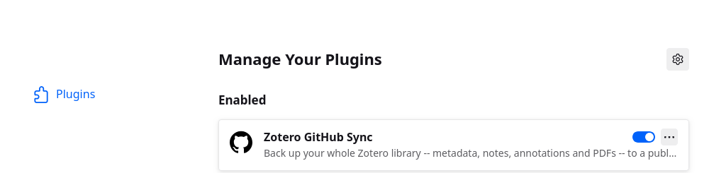
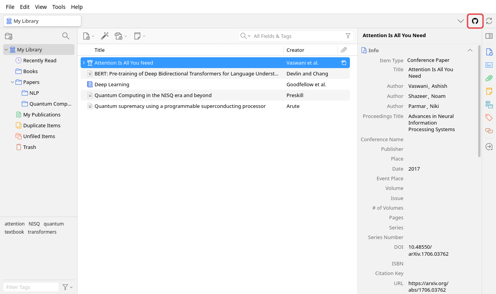
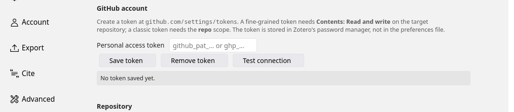
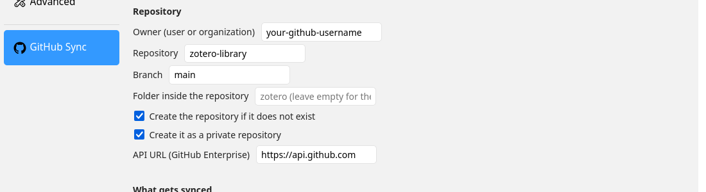
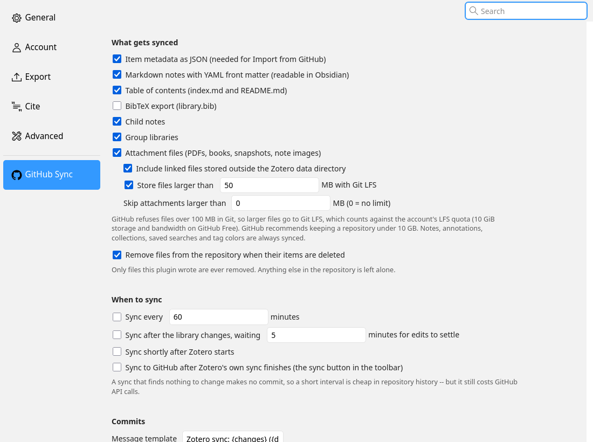
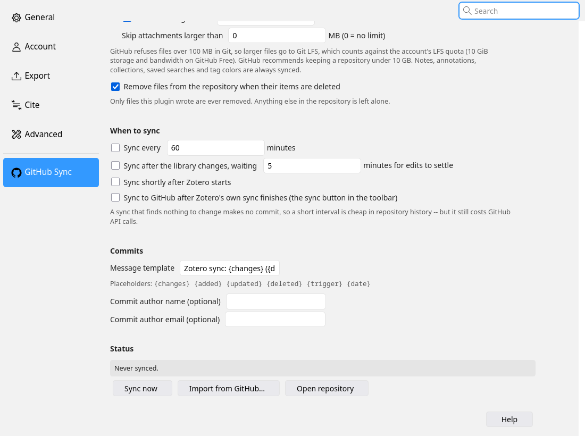
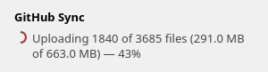
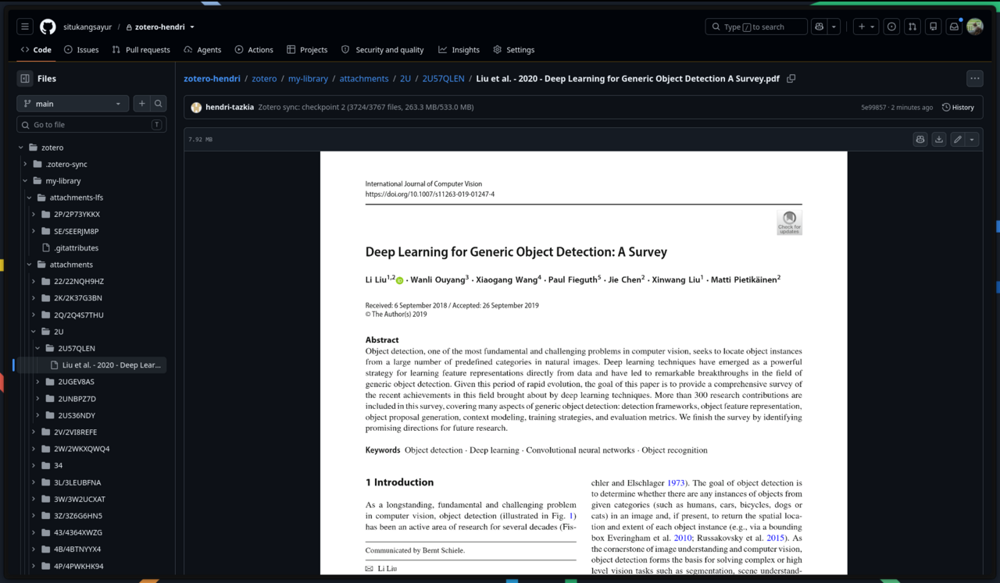

# Tutorial: back up your Zotero library to GitHub

This walks through installing Zotero GitHub Sync, connecting it to a GitHub repository, and
running your first sync. It takes about ten minutes, plus however long your PDFs take to
upload.

*Bahasa Indonesia: [TUTORIAL.id.md](TUTORIAL.id.md)*

---

## 1. Create the repository

On GitHub, create a new repository to hold your library — for example `zotero-library`.
Make it **private** unless you want your library public. You can leave it completely empty;
the plugin makes the first commit itself.

(You can also skip this step and let the plugin create the repository, but that needs an
extra token permission. Creating it yourself is simpler.)

## 2. Create a personal access token

The plugin talks to GitHub's API, so it needs a token. An SSH key won't work.

1. Open <https://github.com/settings/personal-access-tokens/new>
   (**Settings → Developer settings → Personal access tokens → Fine-grained tokens →
   Generate new token**).
2. **Token name:** anything, e.g. `zotero-github-sync`.
3. **Expiration:** your choice. When it expires, syncs fail with *401* and you create a new
   one.
4. **Repository access:** *Only select repositories* → pick the repository from step 1.
5. **Permissions → Repository permissions → Contents:** **Read and write**.
   *Metadata: Read-only* is added automatically. Leave everything else at *No access* —
   Contents also covers Git LFS.
6. **Generate token** and copy it (`github_pat_…`). GitHub shows it only once.

Don't paste the token anywhere except Zotero.

## 3. Install the plugin

1. Download the latest `zotero-github-sync-<version>.xpi` from the
   [Releases page](https://github.com/situkangsayur/zotero-github-plugin/releases/latest).
   In Firefox, right-click the link and choose *Save Link As…*, otherwise Firefox tries to
   install it as a browser extension.
2. In Zotero: **Tools → Plugins**, click the gear icon, then **Install Plugin From File…**
   and choose the `.xpi`.
3. The plugin appears in the list, enabled:

A GitHub button appears in the top-right corner of the main window, next to Zotero's own
sync button:

## 4. Connect it to GitHub

Open **Edit → Settings → GitHub Sync** (on macOS, **Zotero → Settings**).

### GitHub account

1. Paste the token and click **Save token**. It is stored in Zotero's password manager, not
   in a plain-text preferences file.
2. Fill in the repository (next section) before testing.

### Repository

| Field | What to enter |
| --- | --- |
| Owner | Your GitHub username (or an organization) |
| Repository | The repository name from step 1 |
| Branch | `main` |
| Folder inside the repository | Leave **empty** to use the whole repository, or e.g. `zotero` to keep everything under one folder |

Now click **Test connection**. You want to see *"Write access to owner/repository
(private)"*. If it says the repository is *not visible to this token*, edit the token on
GitHub and make sure the repository is selected and Contents is *Read and write*.

### What gets synced

Everything is on by default: item metadata, Markdown notes, child notes, group libraries,
attachment files (PDFs, books, snapshots, images in notes) and linked files. Files larger
than 50 MB go to **Git LFS**, because GitHub refuses files over 100 MB in normal Git.

Keep in mind:

- Git LFS on GitHub Free includes 10 GiB of storage and 10 GiB of bandwidth a month. Only
  files above the threshold use it.
- GitHub recommends keeping a repository under 10 GB.
- Git keeps every version of a file, so replacing a PDF adds to the repository.

### When to sync

| Option | When it syncs |
| --- | --- |
| *Sync every … minutes* | On a timer |
| *Sync after the library changes* | A few minutes after you stop editing |
| *Sync shortly after Zotero starts* | One minute after launch |
| *Sync to GitHub after Zotero's own sync finishes* | Every time you press Zotero's sync button (or Zotero syncs automatically) |

A sync that finds nothing new makes no commit, so frequent syncing doesn't clutter the
history.

## 5. Run your first sync

Click the **GitHub button** in the toolbar, or **Sync now** in the settings.

While it runs, the icon spins and shows the percentage done:

Hover over it for details, or click it to open the progress window:

What happens during a first sync:

1. **Checking attachment files.** Every file is hashed once; later syncs reuse the result, so
   unchanged PDFs are never read again.
2. **Large files to Git LFS.**
3. **Metadata and notes.** All item JSON and Markdown go up in a few requests and are
   committed right away — they appear on GitHub within a minute or two.
4. **Attachment files**, committed in checkpoints every 100 MB or 150 files. If the sync is
   cancelled, fails, or Zotero closes, everything already committed stays, and the next sync
   continues from there.
5. **A final commit** with the list of managed files.

GitHub limits how fast an account can create content (about 80 requests a minute). When the
plugin hits that limit it waits and continues, and the tooltip says until when. To stop a
sync, right-click the button → **Cancel GitHub Sync**, or use **Cancel sync** in the
settings.

When it finishes, the repository holds your library:

- `my-library/items/` — one JSON file per item, with its notes, attachments and annotations
- `my-library/notes/` — a readable Markdown page per item (opens in Obsidian too)
- `my-library/attachments/` and `attachments-lfs/` — the files themselves
- `my-library/index.md` — a table of contents by collection

## 6. If something goes wrong

The button turns red with a dot:

Hover over it to read the error, or look at **Status** in the settings. Common causes:

| Message | Fix |
| --- | --- |
| *GitHub rejected the token (401)* | The token expired or was mistyped. Create a new one and save it again |
| *This token cannot see owner/repo* | The token wasn't given access to that repository. Edit the token on GitHub |
| *GitHub denied the request (403)* | The token lacks *Contents: Read and write* |
| *Git LFS storage quota exceeded (507)* | The account's LFS storage is full. Add LFS budget in GitHub billing, raise the LFS threshold, or turn LFS off |
| *Skipped or not restored* in settings | Each line says why a file was skipped |

For more detail, turn on **Help → Debug Output Logging** before syncing; the plugin's lines
start with `[GitHub Sync]`.

## 7. Restore on another computer

1. Install Zotero and the plugin, and configure the same token, owner and repository.
2. **Tools → GitHub Sync → Import from GitHub…**

Import adds items you don't have (with the same keys, so annotations land on the right PDF),
refreshes items whose repository copy is newer, recreates collections, saved searches and
tag colors, and downloads missing attachment files into Zotero's storage directory. It never
deletes anything from your library.

To get the files with plain Git instead, clone the repository with
[git-lfs](https://git-lfs.com) installed; without it, large files check out as small
pointer files.

## Good to know

- **Zotero stays the source of truth.** Edits made directly on GitHub are overwritten by
  the next sync.
- **Sync from one computer at a time.** Two computers whose libraries differ can undo each
  other's changes in the repository (the history keeps everything).
- **If you use GitHub as your file storage**, you can turn off Zotero's own file syncing
  (**Settings → Sync → File Syncing**) to stop "Zotero File Storage quota" messages. Other
  computers then get files through *Import from GitHub* rather than from zotero.org.
